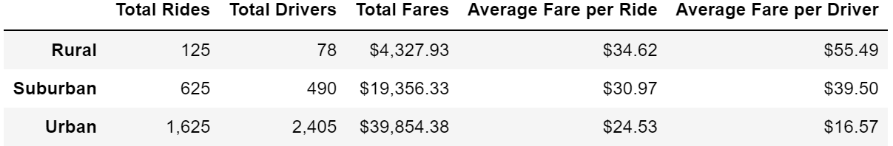
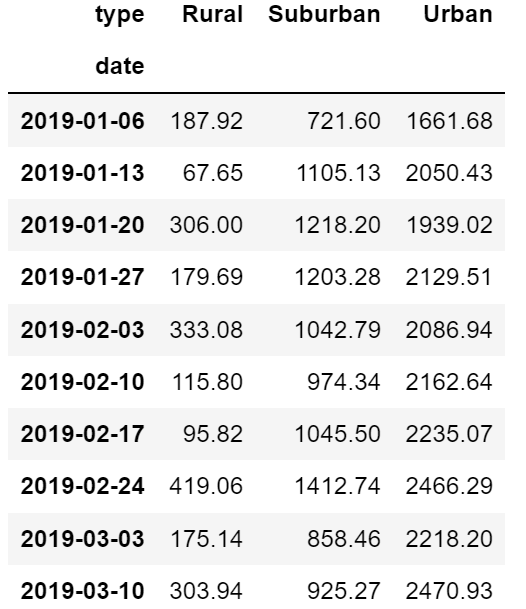
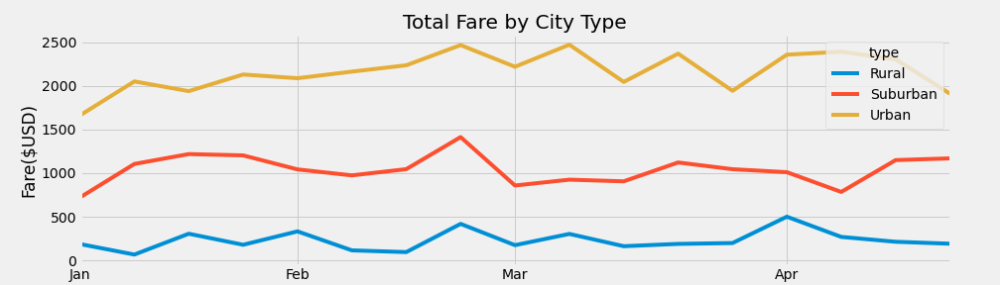

# PyBer Analysis - Ride Sharing Data

## Overview

For this analysis we'll be creating a summary DataFrame of the ride-sharing data by city type. Then, using Pandas and Matplotlib, we'll create a multiple-line graph that shows the total weekly fares for each city type. Finally, we will show how the data differs by city type and how those differences can be used by decision-makers at PyBer.

## Results

The following sections illustrate the differences in ride sharing data among the different city types (Urban, Suburban and Rural).

### Deliverable 1 - Ride Sharing Summary by City Type

The figure above illustrates the ride sharing summary by city types. 

Some key takeaways:
- As expected we can see that the number of rides is higher in densely populated urban environments as compared to less densely populated suburban and rural environments.
- The total fare collection is highest for urban (mainly as a function of highest number of rides), followed by suburban and rural environments.
- On the other hand, average fare per ride as well as average fare per driver is highest for rural, followed by suburban and then urban. This could be due to higher fares in rural and suburban areas as compared to urban; possibly because of lower availability of drivers in those areas as compared to urban areas where the supply of drivers could be plentiful.

### Deliverable 2 - Total fares by City type

The figure above shows the total fares by city type, broken down by week. The data follows a similar trend as described in the prior section, with weekly fares for Urban areas being the highest, followed by suburban and rural.

The figure above shows the total fare by city type as a line chart. We can easily see the trend here with Urban rides having the highest total fare.

## Summary - Business Recommendations

### Recommendation 1
Ensure that we always have enough drivers available in Urban areas as these areas provide the highest overall revenues.

### Recommendation 2
Increase incentives for drivers in rural and suburban areas, so as to increase the overall number of drivers available. The lower number of drivers could be affecting access to the service and as a result we are seeing a very small number of rides.

### Recommendation 3
Reduce fares in Rural and Suburban areas slightly. Right now the average fares are higher in these areas and this could be affecting the affordability and as a result could be resulting in lower number of rides. The slight decrease in fares will likely be offset by a substantial increase in the ridership, thereby increasing the overall fare collections in these areas significantly. We could also consider increasing the fares slightly in urban areas where affordability may not be as big of a concern with the urban population.